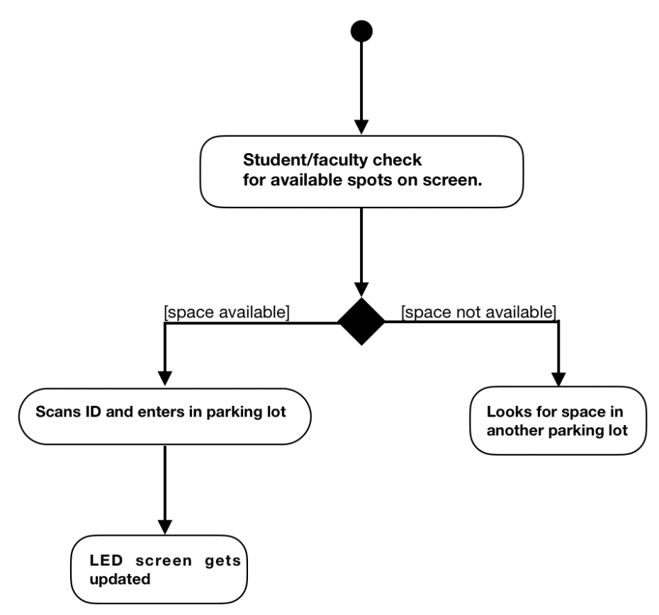

# ParkStation
A parking solution for my university campus using RFID and IoT.

##**Introduction:**  
People working in the MNC or the students spend hundreds of hours per year to find a sport to park their personal vehicles which results in fuel wastage which in result pollutes environment.

##**Objective:**  
*ParkStation* aims to provide seamless, parking and navigation platform aimed for students, professors and small business owners for renting and hosting privately owned parking space across all major cities.

##**Need for the project:**  
*ParkStation* helps masses to address the problem of finding parking spaces around them in real time. It allows you to find and pre-book privately owned parking spots on the go with an option to host your personal vacant parking spot in exchange for money.

##**Methodology:**  

##**Implementation Strategy** *(Campus-wide implementation)*:  
The above mentioned idea can be efficiently implemented throughout the university campus to help students and faculties save time from their every routine.  
Implementation can be as simple as to identify and mark the parking sports in a particular parking lot and have an automated system equipped with ID scanner, a boom barrier (to allow one vehicle at a time, optional) and a LED screen to display the the vacant spots in that particular parking lot.  
This automated system keeps a count of vehicles entering and exiting the parking lot - which is displayed at the lot entrance.  

**Pros:**  
This will solve two of the major problems faced by students or faculties who use parking lot on everyday basis:  
1. Eliminate the time wasted in finding a parking spot in  potentially full parking lot.  
2. To allow vehicles to exit the parking lot in organised manner since now the parking lot will not be overcrowded.  
Required system service is almost zero. Also, man labour required at the gatekeeping is expected to be reduce to one man, which currently, as observed, is 2-3 men.  

**Cons:**  
1. The above mentioned process of scanning ID’s can take longer durating, during peak time, than traditional approach of handing out tickets to individuals.  
2. If more than one vehicle enters with a single ID scan, screen will display false information.  